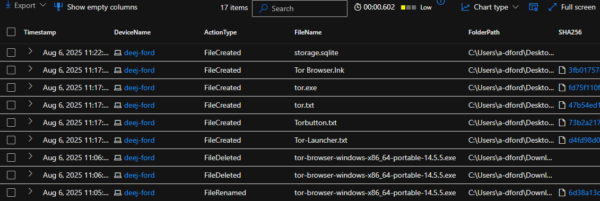
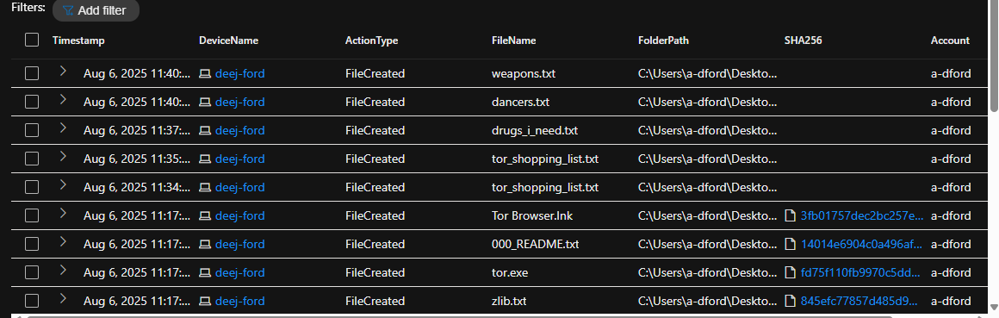
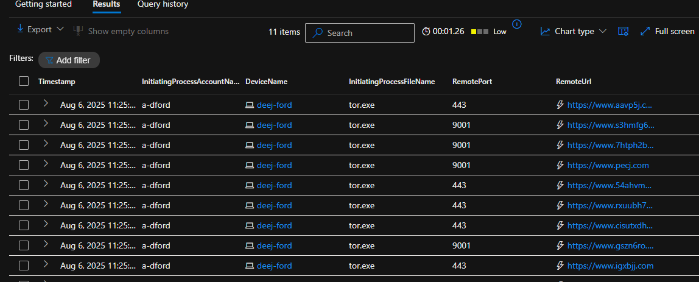

# Threat Hunt Report: Unauthorized TOR Usage
<div align=center>
<br />
</div>

## Technology Utilized

* Windows 10 Virtual Machine (Microsoft Azure)

* Microsoft Defender for Endpoint

* Kusto Query Language (KQL)

* Tor Browser


---

## MDE Tables Referenced:
| **Parameter**       | **Description**                                                              |
|---------------------|------------------------------------------------------------------------------|
| **Name**| DeviceFileEvents|
| **Info**|https://learn.microsoft.com/en-us/defender-xdr/advanced-hunting-deviceinfo-table|
| **Purpose**| Used for detecting TOR download and installation, as well as the shopping list creation and deletion. |

| **Parameter**       | **Description**                                                              |
|---------------------|------------------------------------------------------------------------------|
| **Name**| DeviceProcessEvents|
| **Info**|https://learn.microsoft.com/en-us/defender-xdr/advanced-hunting-deviceinfo-table|
| **Purpose**| Used to detect the silent installation of TOR as well as the TOR browser and service launching.|

| **Parameter**       | **Description**                                                              |
|---------------------|------------------------------------------------------------------------------|
| **Name**| DeviceNetworkEvents|
| **Info**|https://learn.microsoft.com/en-us/defender-xdr/advanced-hunting-devicenetworkevents-table|
| **Purpose**| Used to detect TOR network activity, specifically tor.exe and firefox.exe making connections over ports to be used by TOR (9001, 9030, 9040, 9050, 9051, 9150).|

---


## Scenario

Management suspects that some employees may be using TOR browsers to bypass network security controls because recent network logs show unusual encrypted traffic patterns and connections to known TOR entry nodes. Additionally, there have been anonymous reports of employees discussing ways to access restricted sites during work hours. The goal is to detect anyTOR usage and analyze related security incidents to mitigate potential risks. If any use of TOR is found, notify management.

## High-Level TOR related IoC (Indicators of Compromise) Disocvery Plan:

* Check `DeviceFileEvents` for any `tor(.exe)` or `firefox(.exe)` file events

* Check `DeviceProcessEvents` for any signs of installation or usage

* Check `DeviceNetworkEvents` for any signs of outgoing connections over known TOR ports 

## Steps Taken


Step 1) Searched `DeviceFileEvents` 

Searched the DeviceFileEvents table for ANY file that had the string "tor" in it and discovered the user "a-dford" downloaded a tor installer, renamed it, and then did something that resulted in other tor-related files to be created on the desktop. The user then deleted the downloaded tor installer and created a file named "tor_shopping_list.txt". These events began at: 2025-08-07T04:05:30.6764524Z. The SHA256 of the downloaded installer is: `6d38a13c6a5865b373ef1e1ffcd31b3f359abe896571d27fa666ce71c486a40d`.

```
DeviceFileEvents
| where DeviceName == "deej-ford"
| where InitiatingProcessAccountName == "a-dford"
| where Timestamp >= datetime(2025-08-07T04:05:30.6764524Z)
| where FileName has_any("tor", ".txt")
| order by Timestamp desc
| project Timestamp, DeviceName, ActionType, FileName, FolderPath, SHA256, Account = InitiatingProcessAccountName
```

<div align=center>
    <br />
</div>


<div align=center>
    <br />
</div>


<hr>


Step 2) Searched `DeviceProcessEvents`

Searched the DeviceProcessEvents table for ANY command line process that contained the downloaded tor installer "tor-browser-windows-x86_64-portable-14.5.5.5.exe" but no result were returned. Since the file was renamed, I searched for any command line process with the matching SHA256, and an entry with the file name of "file.exe" was populated. It shows that the user executed the "file.exe" with the `/S` argument to trigger a silent install.

```
DeviceProcessEvents
| where DeviceName == "deej-ford"
| where InitiatingProcessAccountName == "a-dford"
| where Timestamp >= datetime(2025-08-07T04:05:30.6764524Z)
| where SHA256 == "6d38a13c6a5865b373ef1e1ffcd31b3f359abe896571d27fa666ce71c486a40d"
```
<hr>


<div align=center>
    <br />
</div>

Step 3) Searched `DeviceNetworkEvents`

Searched the DeviceNetworkEvents table for InitiatingProcessFileNames of "tor.exe" or "firefox.exe" to check for TOR browser usage and results populated confirming TOR browser usage. At 2025-08-07T04:25:49.7262415Z, user "a-dford" on the device "deej-ford", used tor.exe to establish connection to several URLs over ports 443 and 9001.

```
DeviceNetworkEvents
| where DeviceName == "deej-ford"
| where InitiatingProcessFileName in~ ("tor.exe", "firefox.exe")
| where RemoteUrl != ""
| project Timestamp, InitiatingProcessAccountName, DeviceName, InitiatingProcessFileName, RemotePort, RemoteUrl
| order by Timestamp desc
```

<div align=center>
    <br />
</div>

<hr>


## Chronological Events

1. [2025-08-06 23:05:30]
User `a-dford` downloaded the TOR browser installer named:
`tor-browser-windows-x86_64-portable-14.5.5.exe`
SHA256: `6d38a13c6a5865b373ef1e1ffcd31b3f359abe896571d27fa666ce71c486a40d`


2. Shortly after
The user renamed the downloaded installer to `file.exe`.


3. [2025-08-06 23:16:50]
The renamed installer file.exe was executed silently with the command:
`"file.exe" /S`
Initiated by: `powershell.exe`
SHA256: `6d38a13c6a5865b373ef1e1ffcd31b3f359abe896571d27fa666ce71c486a40d`

4. The user deleted the original installer.

5. Post-installation
A folder and supporting files were created (e.g., tor_shopping_list), including text files titled:
`drugs_i_need.txt`, `dancers.txt`, and `weapons.txt`.

6. [2025-08-06 23:25:09 to 23:25:49]
The process `tor.exe` initiated multiple outbound connections using TOR protocol:

Ports: 443 and 9001

URLs include:

`https://www.2xw5lzvz6yrvicsbfdgp.com`

`https://www.igxbjj.com`

`https://www.26qkmlel.com`

`https://www.aavp5j.com`

`https://www.s3hmfg6y2hqni7iyvijzipvi.com`

`https://www.7htph2bytvj7xt2iuj2kprg2.com`

`https://www.pecj.com`

`https://www.54ahvmbu5kvjvmh.com`

`https://www.rxuubh757u.com`

`https://www.cisutxdh.com`


## Summary

The user `a-dford` downloaded a TOR installer and renamed it to `file.exe`—a generic name likely chosen to maintain stealth. `a-dford` then silently installed `file.exe` using PowerShell with the `/S` flag. After installation, the user deleted the original TOR installer.

Next, they navigated to the Downloads directory and executed the command `./firefox.exe` to launch the TOR browser. They created a directory named `tor_shopping_list` and generated several text files titled `drugs_i_need.txt`, `dancers.txt`, and `weapons.txt`.

Logs show that the `tor_shopping_list` directory was created twice, but there is no corresponding deletion event. This may indicate the use of a force deletion method (e.g., PowerShell `Remove-Item` with `-Force`) that bypassed standard logging.


## Response

TOR usage was detected, the user's account was disabled, the device was isolated and an anti-virus scan was performed, and the user's manager was notified.

